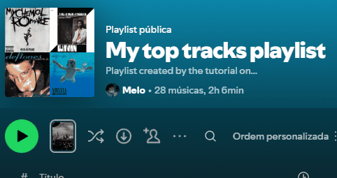

# 🎵 Spotify Playlist Sorter
Uma ferramenta de linha de comando construída em Python para organizar playlists do Spotify com filtros avançados e personalizáveis que não existem no aplicativo oficial.




## 🎯 Sobre o Projeto
Como um grande fã de música e um ávido curador de playlists, sempre senti falta de opções mais poderosas para ordenar minhas músicas. Este projeto nasceu da minha necessidade pessoal de poder organizar playlists por múltiplos critérios simultaneamente (como artista, data de lançamento do álbum, popularidade, etc.), de forma rápida e automática.


## ✨ Funcionalidades
* **Autenticação Segura:** Utiliza o protocolo OAuth 2.0 do Spotify para acesso seguro à sua conta.
* **Seleção de Múltiplas Playlists:** Organize várias playlists de uma só vez com as mesmas regras, economizando tempo.
* **Filtros de Ordenação Múltiplos:** Escolha múltiplos critérios de ordenação em ordem de prioridade.
* **Controle de Direção:** Ordene de forma Crescente (A-Z, mais antiga) ou Decrescente (Z-A, mais nova).
* **Interface Interativa:** Guiado por um menu de linha de comando simples e intuitivo.


## 🛠️ Tecnologias Utilizadas
* **Python 3**
* **Spotipy:** Uma biblioteca Python leve para a API Web do Spotify.
* **python-dotenv:** Para gerenciamento seguro de variáveis de ambiente.


## 🚀 Como Executar o Projeto
Siga os passos abaixo para executar o projeto localmente.

1.  **Clone o repositório:**
    ```bash
    git clone [https://github.com/seu-usuario/seu-repositorio.git](https://github.com/seu-usuario/seu-repositorio.git)
    ```
2.  **Navegue até a pasta do projeto:**
    ```bash
    cd seu-repositorio
    ```
3.  **Crie e ative um ambiente virtual:**
    ```bash
    python -m venv .venv
    .venv\Scripts\activate
    ```
4.  **Instale as dependências:**
    ```bash
    pip install -r requirements.txt
    ```
5.  **Configure suas credenciais:**
    * Crie um arquivo `.env` na raiz do projeto.
    * Adicione suas credenciais do Spotify Developer:
        ```
        SPOTIPY_CLIENT_ID='seu_id_aqui'
        SPOTIPY_CLIENT_SECRET='seu_secret_aqui'
        SPOTIPY_REDIRECT_URI='[http://127.0.0.1:8888/callback](http://127.0.0.1:8888/callback)'
        ```
6.  **Execute o script:**
    ```bash
    python sort_spotify.py
    ```


## 🔜 Próximos Passos
O futuro deste projeto é se tornar uma aplicação web completa e acessível a todos. Os próximos passos planejados são:

-   [ ] Desenvolver a interface web com o framework **Flask**.
-   [ ] Implementar um sistema de backup para restaurar a ordem original das playlists.
-   [ ] Criar uma funcionalidade de "Presets" para salvar e aplicar configurações de ordenação favoritas.